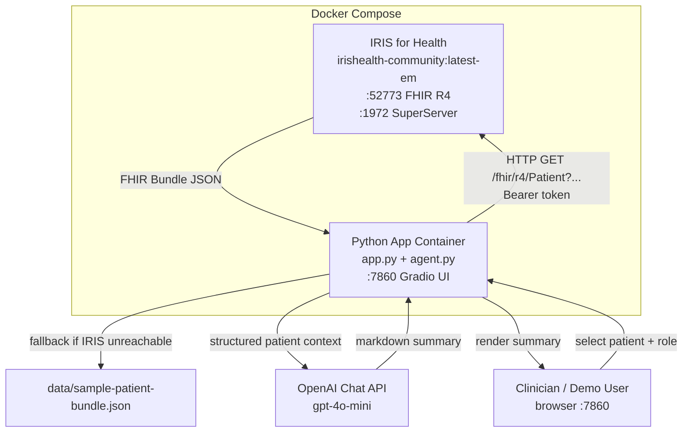
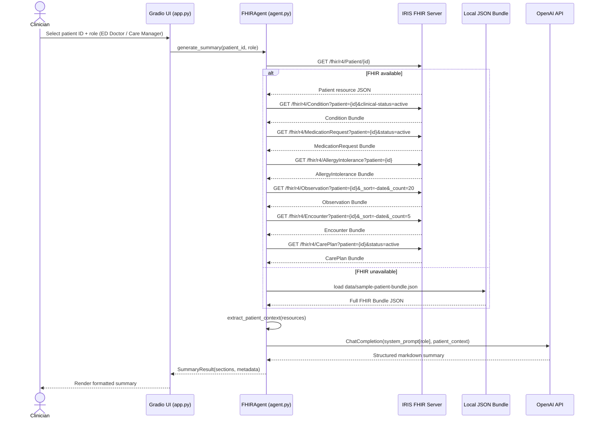
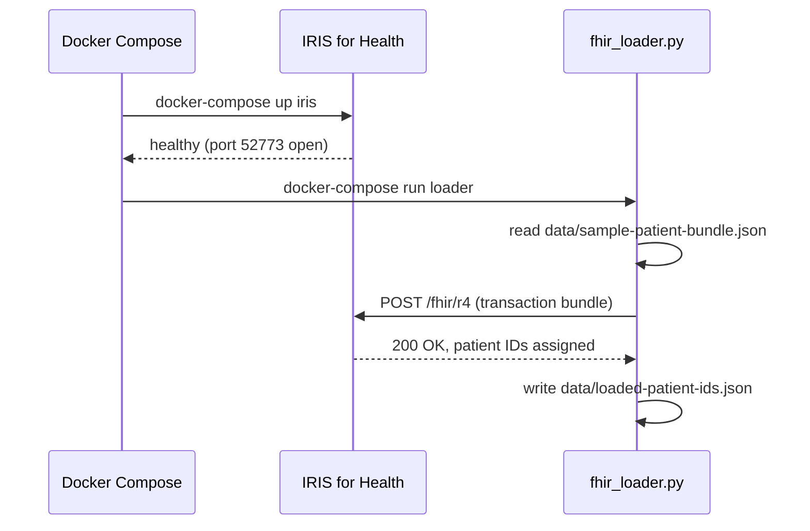

# Design Document: Smart Patient Summary Generator (fhir-patient-summary)

## Overview

The Smart Patient Summary Generator is a clinician-facing AI agent application that retrieves a patient's FHIR R4 resources from an InterSystems IRIS for Health FHIR server, then uses an LLM (OpenAI) to synthesize a concise, role-specific summary structured into three sections: **Current Issues**, **Recent Changes**, and **Risks and Follow-up**. The application is packaged entirely in Docker, uses a Gradio web UI for demos, and includes a local JSON bundle fallback so the workflow can run without a live FHIR server.

The system is designed for a 2-day build window targeting the InterSystems Programming Contest: AI Agents for FHIR (submission deadline June 7, 2026). It demonstrates FHIR API integration, Embedded Python, Docker, and an LLM/AI agent workflow — all contest bonus categories.

---

## Architecture



### Container Layout

| Container | Image | Purpose |
|-----------|-------|---------|
| `iris` | `intersystems/irishealth-community:latest-em` | Hosts FHIR R4 endpoint at `/fhir/r4` |
| `app` | `python:3.11-slim` (custom) | Runs Gradio UI + AI agent; communicates with IRIS and OpenAI |

The `app` container depends on `iris` but starts in fallback mode if IRIS is not reachable within the health-check window.

---

## Sequence Diagrams

### Main Summary Generation Flow



### FHIR Server Initialization Flow



---

## Components and Interfaces

### Component 1: FHIRClient (`fhir_client.py`)

**Purpose**: Abstracts all HTTP communication with the IRIS FHIR R4 endpoint. Handles authentication, retries, and fallback to local bundle.

**Interface**:
```python
class FHIRClient:
    def __init__(self, base_url: str, username: str, password: str,
                 fallback_path: str = "data/sample-patient-bundle.json") -> None: ...

    def get_resource(self, resource_type: str, patient_id: str,
                     params: dict[str, str] | None = None) -> list[dict]: ...
    # Returns list of FHIR resource dicts (entries from bundle).
    # Raises FHIRUnavailableError if server unreachable; caller should use fallback.

    def list_patients(self) -> list[dict]:
    # Returns list of Patient resources available on the server or in fallback bundle.
    ...

    def is_available(self) -> bool: ...
    # Probe /fhir/r4/metadata; returns True if reachable.
```

**Responsibilities**:
- Perform authenticated GET requests to FHIR R4 endpoints
- Parse FHIR Bundle responses and extract `entry[].resource` lists
- Raise `FHIRUnavailableError` on connection failure, triggering fallback path
- Load and parse `data/sample-patient-bundle.json` in fallback mode

---

### Component 2: PatientContextExtractor (`context_extractor.py`)

**Purpose**: Converts raw FHIR resource lists into a compact, token-efficient string representation suitable for LLM consumption.

**Interface**:
```python
class PatientContextExtractor:
    def extract(self, resources: PatientResources) -> str: ...
    # Returns a structured plain-text context block.

@dataclass
class PatientResources:
    patient: dict
    conditions: list[dict]
    medications: list[dict]
    allergies: list[dict]
    observations: list[dict]
    encounters: list[dict]
    care_plans: list[dict]
```

**Responsibilities**:
- Extract patient demographics (name, DOB, gender, MRN)
- Summarize active conditions using `code.text` or `code.coding[0].display`
- List active/current medications with dosage where available
- List allergies with severity and reaction
- Format the 10 most recent lab observations as `name: value unit (date)`
- Summarize the 3 most recent encounters by type, date, and reason
- Include active CarePlan goals and activities
- Keep total output under 3,000 tokens to stay within LLM context limits

---

### Component 3: SummaryAgent (`agent.py`)

**Purpose**: Orchestrates FHIR data retrieval and LLM call; returns a structured `SummaryResult`.

**Interface**:
```python
class SummaryAgent:
    def __init__(self, fhir_client: FHIRClient,
                 extractor: PatientContextExtractor,
                 llm_client: OpenAI) -> None: ...

    def generate_summary(self, patient_id: str,
                         role: Literal["ED Doctor", "Care Manager"]) -> SummaryResult: ...

@dataclass
class SummaryResult:
    patient_name: str
    patient_id: str
    role: str
    current_issues: str
    recent_changes: str
    risks_and_followup: str
    data_source: Literal["fhir_server", "local_fallback"]
    generated_at: str  # ISO timestamp
    error: str | None = None
```

**Responsibilities**:
- Fetch all required FHIR resources via `FHIRClient`
- Detect fallback mode and set `data_source` accordingly
- Build the structured patient context string via `PatientContextExtractor`
- Select the role-specific system prompt
- Call the OpenAI Chat API and parse the structured response into three sections
- Handle API errors gracefully, setting `SummaryResult.error`

---

### Component 4: Gradio UI (`app.py`)

**Purpose**: Provides the web interface for patient selection, role selection, and summary display. Replaces the existing `ui.py` mock.

**Interface** (Gradio components):
- `patient_dropdown`: `gr.Dropdown` — populated from `FHIRClient.list_patients()`
- `role_radio`: `gr.Radio` — choices: `["ED Doctor", "Care Manager"]`
- `generate_btn`: `gr.Button` — triggers `on_generate`
- `summary_output`: `gr.Markdown` — renders the formatted summary
- `source_badge`: `gr.HTML` — shows `FHIR Server` or `Local Fallback` badge
- `status_bar`: `gr.Textbox` — shows loading/error state

**Responsibilities**:
- On load: probe FHIR availability and populate patient dropdown
- On generate: call `SummaryAgent.generate_summary()` and render the result
- Show data source and generation timestamp in the footer
- Display errors in a user-friendly format without stack traces

---

### Component 5: FHIR Loader (`fhir_loader.py`)

**Purpose**: One-time script that POSTs the local FHIR bundle to the IRIS FHIR server at startup.

**Interface**:
```python
def load_bundle(fhir_base_url: str, bundle_path: str,
                username: str, password: str) -> list[str]:
    # Returns list of assigned patient IDs.
    ...
```

**Responsibilities**:
- Read `data/sample-patient-bundle.json`
- POST as a FHIR transaction bundle to `{base_url}` (the FHIR R4 base)
- Log success/failure per resource type
- Write assigned patient IDs to `data/loaded-patient-ids.json`

---

## Data Models

### PatientResources (runtime dataclass)

```python
@dataclass
class PatientResources:
    patient: dict                # FHIR Patient resource
    conditions: list[dict]       # FHIR Condition resources
    medications: list[dict]      # FHIR MedicationRequest resources
    allergies: list[dict]        # FHIR AllergyIntolerance resources
    observations: list[dict]     # FHIR Observation resources (most recent first)
    encounters: list[dict]       # FHIR Encounter resources (most recent first)
    care_plans: list[dict]       # FHIR CarePlan resources
```

**Validation Rules**:
- `patient` must be non-empty dict with at minimum `id` and `resourceType == "Patient"`
- All list fields default to `[]` — missing resource types are non-fatal
- `observations` capped at 20 entries; `encounters` capped at 5

### SummaryResult (runtime dataclass)

```python
@dataclass
class SummaryResult:
    patient_name: str
    patient_id: str
    role: str
    current_issues: str       # Markdown text
    recent_changes: str       # Markdown text
    risks_and_followup: str   # Markdown text
    data_source: Literal["fhir_server", "local_fallback"]
    generated_at: str         # ISO 8601 UTC
    error: str | None = None
```

**Validation Rules**:
- If `error` is set, the three section fields may be empty strings
- `generated_at` is always set even on error

### FHIR Bundle (file: `data/sample-patient-bundle.json`)

A valid FHIR R4 transaction bundle containing at minimum:
- 1 `Patient` resource
- ≥ 3 `Condition` resources (active diagnoses)
- ≥ 5 `MedicationRequest` resources
- ≥ 1 `AllergyIntolerance` resource
- ≥ 10 `Observation` resources (lab values + vitals)
- ≥ 3 `Encounter` resources (recent visits)
- ≥ 1 `CarePlan` resource

Source: adapted from InterSystems `samples-FHIR-resource-repository` Synthea bundles.

---

## Role-Specific Prompt Design

### ED Doctor Prompt

```
You are a clinical AI assistant generating a concise patient summary for an Emergency Department physician.
Focus on: active diagnoses, current medications and allergies (drug safety), the most recent labs and vitals,
and any acute concerns. Be brief, use medical shorthand where appropriate, and highlight anything
immediately actionable. Do not include care management goals or long-term follow-up plans.

Structure your response EXACTLY as:
## Current Issues
<bullet points>

## Recent Changes
<bullet points>

## Risks and Follow-up
<bullet points>
```

### Care Manager Prompt

```
You are a clinical AI assistant generating a patient summary for a Care Manager focused on chronic
disease management and care coordination. Focus on: chronic conditions, medication adherence,
pending care plan goals, upcoming follow-up needs, and social/functional risks.
Use plain clinical language. Include actionable care coordination items.

Structure your response EXACTLY as:
## Current Issues
<bullet points>

## Recent Changes
<bullet points>

## Risks and Follow-up
<bullet points>
```

---

## Key Functions with Formal Specifications

### Function 1: `FHIRClient.get_resource()`

```python
def get_resource(self, resource_type: str, patient_id: str,
                 params: dict[str, str] | None = None) -> list[dict]
```

**Preconditions:**
- `resource_type` is one of: `Patient`, `Condition`, `MedicationRequest`, `AllergyIntolerance`, `Observation`, `Encounter`, `CarePlan`
- `patient_id` is a non-empty string
- The client is initialized with a valid `base_url`

**Postconditions:**
- Returns a list of FHIR resource dicts (may be empty if no matching resources)
- Each dict has `resourceType` matching `resource_type`
- If the FHIR server returns HTTP 4xx or 5xx, raises `FHIRClientError`
- If the server is unreachable (timeout/connection refused), raises `FHIRUnavailableError`
- Does not mutate inputs

**Loop Invariants:** N/A (single HTTP call)

---

### Function 2: `PatientContextExtractor.extract()`

```python
def extract(self, resources: PatientResources) -> str
```

**Preconditions:**
- `resources.patient` is a non-empty dict with `resourceType == "Patient"`
- All list fields in `resources` are lists (may be empty)

**Postconditions:**
- Returns a non-empty string
- The string contains patient demographics
- The string length in tokens is ≤ 3,000 (enforced by truncation)
- Does not mutate `resources`

**Loop Invariants:**
- For each resource list processed, all previously added items remain in the output string

---

### Function 3: `SummaryAgent.generate_summary()`

```python
def generate_summary(self, patient_id: str,
                     role: Literal["ED Doctor", "Care Manager"]) -> SummaryResult
```

**Preconditions:**
- `patient_id` is a non-empty string
- `role` is exactly `"ED Doctor"` or `"Care Manager"`
- `OPENAI_API_KEY` environment variable is set

**Postconditions:**
- Returns a `SummaryResult` with `patient_id` matching input
- If successful: `error is None` and all three section fields are non-empty strings
- If LLM call fails: `error` is set, sections contain empty strings or partial content
- `data_source` reflects whether IRIS FHIR server was used or fallback
- `generated_at` is set to current UTC time in ISO 8601 format

**Loop Invariants:** N/A

---

## Algorithmic Pseudocode

### Main Summary Generation Algorithm

```pascal
ALGORITHM generate_summary(patient_id, role)
INPUT: patient_id: String, role: Enum{"ED Doctor", "Care Manager"}
OUTPUT: SummaryResult

BEGIN
  ASSERT patient_id ≠ "" AND role IN {"ED Doctor", "Care Manager"}

  // Step 1: Determine data source
  IF fhir_client.is_available() THEN
    data_source ← "fhir_server"
    resources ← fetch_all_fhir_resources(fhir_client, patient_id)
  ELSE
    data_source ← "local_fallback"
    resources ← load_from_local_bundle(patient_id)
  END IF

  ASSERT resources.patient ≠ {}

  // Step 2: Build compact patient context
  context_text ← extractor.extract(resources)
  ASSERT length_in_tokens(context_text) ≤ 3000

  // Step 3: Select role-specific prompt
  system_prompt ← ROLE_PROMPTS[role]

  // Step 4: Call LLM
  TRY
    response ← llm_client.chat.completions.create(
      model = "gpt-4o-mini",
      messages = [
        {role: "system", content: system_prompt},
        {role: "user", content: context_text}
      ],
      temperature = 0.3,
      max_tokens = 800
    )
    raw_text ← response.choices[0].message.content
    sections ← parse_sections(raw_text)
    ASSERT "current_issues" IN sections
    ASSERT "recent_changes" IN sections
    ASSERT "risks_and_followup" IN sections
    error ← NULL
  CATCH OpenAIError AS e
    sections ← {"current_issues": "", "recent_changes": "", "risks_and_followup": ""}
    error ← str(e)
  END TRY

  RETURN SummaryResult(
    patient_name = extract_name(resources.patient),
    patient_id = patient_id,
    role = role,
    current_issues = sections["current_issues"],
    recent_changes = sections["recent_changes"],
    risks_and_followup = sections["risks_and_followup"],
    data_source = data_source,
    generated_at = utc_now_iso(),
    error = error
  )
END
```

**Preconditions:**
- `patient_id` is non-empty and refers to a patient in FHIR server or local bundle
- `role` is a valid role string
- LLM client is initialized (OpenAI API key present)

**Postconditions:**
- `SummaryResult` is always returned (never throws unhandled exception)
- `data_source` reflects actual data origin
- On LLM failure, `error` field is populated

**Loop Invariants:** N/A

---

### FHIR Resource Fetch Algorithm

```pascal
ALGORITHM fetch_all_fhir_resources(fhir_client, patient_id)
INPUT: fhir_client: FHIRClient, patient_id: String
OUTPUT: PatientResources

BEGIN
  resource_types ← [
    ("Patient",            {_id: patient_id}),
    ("Condition",          {patient: patient_id, "clinical-status": "active"}),
    ("MedicationRequest",  {patient: patient_id, status: "active"}),
    ("AllergyIntolerance", {patient: patient_id}),
    ("Observation",        {patient: patient_id, _sort: "-date", _count: "20"}),
    ("Encounter",          {patient: patient_id, _sort: "-date", _count: "5"}),
    ("CarePlan",           {patient: patient_id, status: "active"})
  ]

  results ← {}

  FOR EACH (resource_type, params) IN resource_types DO
    TRY
      entries ← fhir_client.get_resource(resource_type, patient_id, params)
      results[resource_type] ← entries
    CATCH FHIRClientError AS e
      LOG warning: "Failed to fetch {resource_type}: {e}"
      results[resource_type] ← []
    END TRY
  END FOR

  ASSERT "Patient" IN results AND results["Patient"] ≠ []

  RETURN PatientResources(
    patient    = results["Patient"][0],
    conditions = results.get("Condition", []),
    medications = results.get("MedicationRequest", []),
    allergies  = results.get("AllergyIntolerance", []),
    observations = results.get("Observation", []),
    encounters = results.get("Encounter", []),
    care_plans = results.get("CarePlan", [])
  )
END
```

**Preconditions:**
- `fhir_client.is_available()` returned `True`
- `patient_id` is non-empty

**Postconditions:**
- Returns `PatientResources` with at minimum a non-empty `patient` field
- Missing resource types default to empty lists (non-fatal)

**Loop Invariants:**
- For each iteration, previously fetched resource types remain in `results`
- `results` grows monotonically by resource type

---

### Section Parsing Algorithm

```pascal
ALGORITHM parse_sections(raw_text)
INPUT: raw_text: String (LLM output)
OUTPUT: Dict{current_issues, recent_changes, risks_and_followup}

BEGIN
  sections ← {
    "current_issues": "",
    "recent_changes": "",
    "risks_and_followup": ""
  }

  HEADER_MAP ← {
    "## Current Issues":        "current_issues",
    "## Recent Changes":        "recent_changes",
    "## Risks and Follow-up":   "risks_and_followup"
  }

  current_key ← NULL
  buffer ← []

  FOR EACH line IN raw_text.split("\n") DO
    IF line IN HEADER_MAP THEN
      IF current_key ≠ NULL THEN
        sections[current_key] ← "\n".join(buffer).strip()
      END IF
      current_key ← HEADER_MAP[line]
      buffer ← []
    ELSE IF current_key ≠ NULL THEN
      buffer.append(line)
    END IF
  END FOR

  IF current_key ≠ NULL THEN
    sections[current_key] ← "\n".join(buffer).strip()
  END IF

  RETURN sections
END
```

**Preconditions:**
- `raw_text` is a string (may be empty)

**Postconditions:**
- Returns dict with all three keys always present
- Values are stripped strings (may be empty if LLM omits a section)

**Loop Invariants:**
- `buffer` collects only lines belonging to `current_key`

---

## Example Usage

### Python — Direct Agent Call

```python
import os
from fhir_client import FHIRClient
from context_extractor import PatientContextExtractor
from agent import SummaryAgent
from openai import OpenAI

client = FHIRClient(
    base_url="http://localhost:52773/fhir/r4",
    username="superuser",
    password=os.environ["IRIS_PASSWORD"],
    fallback_path="data/sample-patient-bundle.json"
)
extractor = PatientContextExtractor()
llm = OpenAI(api_key=os.environ["OPENAI_API_KEY"])
agent = SummaryAgent(fhir_client=client, extractor=extractor, llm_client=llm)

result = agent.generate_summary(patient_id="patient-001", role="ED Doctor")
print(f"Source: {result.data_source}")
print(f"\n## Current Issues\n{result.current_issues}")
print(f"\n## Recent Changes\n{result.recent_changes}")
print(f"\n## Risks and Follow-up\n{result.risks_and_followup}")
```

### Running with Docker Compose

```bash
# 1. Copy and configure environment
cp .env.example .env
# Edit .env: set OPENAI_API_KEY and optionally IRIS_PASSWORD

# 2. Start IRIS for Health
docker-compose up iris -d

# 3. Wait for IRIS to be healthy, then load FHIR data
docker-compose run --rm loader

# 4. Start the Gradio application
docker-compose up app

# 5. Open browser at http://localhost:7860
```

### Fallback Mode (no IRIS)

```bash
# Skip IRIS — app automatically reads data/sample-patient-bundle.json
docker-compose up app
# UI shows "Local Fallback" badge; full summary generation still works
```

---

## Error Handling

### Error Scenario 1: FHIR Server Unavailable

**Condition**: `FHIRClient.is_available()` returns `False` (IRIS not running or not ready)
**Response**: Agent loads `data/sample-patient-bundle.json` instead; UI shows amber "Local Fallback" badge
**Recovery**: Automatic; next request re-probes IRIS availability

### Error Scenario 2: Patient Not Found

**Condition**: FHIR server returns 0 Patient resources for the given ID; local bundle has no matching patient
**Response**: `SummaryResult.error` = `"Patient {id} not found"`; UI shows error message in summary panel
**Recovery**: User selects a different patient from the dropdown

### Error Scenario 3: OpenAI API Error

**Condition**: OpenAI API returns non-200 response, rate limit, or timeout
**Response**: `SummaryResult.error` set; UI shows `"LLM error: {message}"`; sections are empty
**Recovery**: User clicks "Generate" again; exponential backoff for rate-limit errors

### Error Scenario 4: Missing API Key

**Condition**: `OPENAI_API_KEY` environment variable is not set
**Response**: Application startup raises `EnvironmentError` with clear message before Gradio launches
**Recovery**: User sets the variable in `.env` and restarts

### Error Scenario 5: Malformed LLM Response

**Condition**: LLM returns text not matching expected `## Section` headers
**Response**: `parse_sections()` returns sections as empty strings; raw LLM text appended to `risks_and_followup`
**Recovery**: Non-fatal; summary still displays with partial content

---

## Testing Strategy

### Unit Testing Approach

Key unit tests:
- `test_context_extractor.py`: verify token budget enforcement; verify all fields appear in output; test with empty resource lists (graceful degradation)
- `test_parse_sections.py`: round-trip parse of known LLM output; test with missing sections; test with extra whitespace
- `test_fhir_client_fallback.py`: verify fallback activates when server unreachable; verify fallback bundle parsing
- `test_summary_result.py`: verify error field is set on LLM failure; verify `generated_at` is always set

### Property-Based Testing Approach

**Property Test Library**: `hypothesis` (Python)

Key properties:
- For any `PatientResources` with non-empty patient, `extract()` returns non-empty string of ≤ 3,000 tokens
- For any string input, `parse_sections()` always returns a dict with all three keys
- For any `SummaryResult`, if `error` is None then all three section fields are non-empty

### Integration Testing Approach

- Load `data/sample-patient-bundle.json` into a test IRIS instance (Docker)
- Verify all 7 FHIR resource types are fetchable via the client
- End-to-end: call `generate_summary()` with real OpenAI key and verify structured sections appear

---

## Performance Considerations

- FHIR queries are run sequentially per role; parallel fetch (asyncio) is an optional optimization if latency > 5s
- Observation count capped at 20, Encounter at 5 to bound context size
- LLM `max_tokens=800` limits response latency to ~3–5 seconds on gpt-4o-mini
- Local bundle loaded once at startup and cached in memory for fallback mode

---

## Security Considerations

- `OPENAI_API_KEY` and `IRIS_PASSWORD` passed via environment variables; never committed to repository
- `.env` is in `.gitignore`; only `.env.example` with placeholder values is committed
- IRIS is accessed over localhost; no external FHIR endpoint exposure
- No real patient data — all data is synthetic Synthea-generated bundles
- Gradio bound to `0.0.0.0:7860`; in contest/demo context this is acceptable; production would add auth

---

## Dependencies

| Package | Version | Purpose |
|---------|---------|---------|
| `gradio` | ≥ 4.0 | Web UI |
| `openai` | ≥ 1.0 | LLM API client |
| `requests` | ≥ 2.31 | FHIR REST calls |
| `python-dotenv` | ≥ 1.0 | Load `.env` file |
| `hypothesis` | ≥ 6.0 | Property-based testing |
| `pytest` | ≥ 8.0 | Test runner |

InterSystems IRIS for Health Community Edition (`intersystems/irishealth-community:latest-em`) is run as a Docker container and accessed via HTTP — no Python IRIS client library required.

---

## Correctness Properties

*A property is a characteristic or behavior that should hold true across all valid executions of a system — essentially, a formal statement about what the system should do. Properties serve as the bridge between human-readable specifications and machine-verifiable correctness guarantees.*

### Property 1: Resource type filter correctness

For any valid FHIR resource type and any non-empty patient ID, `FHIRClient.get_resource()` must return a list in which every element has a `resourceType` field equal to the requested resource type — no resources of a different type may appear in the result.

**Validates: Requirements 1.1, 1.5**

### Property 2: HTTP error codes raise FHIRClientError

For any HTTP status code in the range 400–599, when the IRIS_FHIR_Server returns that status code, `FHIRClient.get_resource()` must raise a `FHIRClientError` and must not return a resource list.

**Validates: Requirements 1.3**

### Property 3: Data source invariant

For any `patient_id` and any server availability state, `SummaryResult.data_source` must equal `"fhir_server"` if and only if `FHIRClient.is_available()` returned `True` for that request; it must equal `"local_fallback"` if and only if `FHIRClient.is_available()` returned `False`.

**Validates: Requirements 2.3, 2.4, 2.5**

### Property 4: Context extraction completeness

For any `PatientResources` value with a non-empty `patient` dict, `PatientContextExtractor.extract()` must return a non-empty string that contains patient demographics (name, date of birth, gender), and for each resource list that is non-empty, the corresponding clinical section (conditions, medications, allergies, observations, encounters, care plan goals) must appear in the output.

**Validates: Requirements 3.1, 3.2, 3.3, 3.4, 3.5, 3.6, 3.7, 3.8**

### Property 5: Context extraction token budget

For any `PatientResources` value with a non-empty `patient` dict — including inputs with large numbers of resources — `PatientContextExtractor.extract()` must return a string whose token count is at most 3,000.

**Validates: Requirements 3.9**

### Property 6: Empty resource list renders as "None"

For any `PatientResources` where one or more resource lists are empty, `PatientContextExtractor.extract()` must include each empty section in the output string with the marker `"None"` rather than omitting the section.

**Validates: Requirements 3.10**

### Property 7: PatientResources immutability

For any `PatientResources` value, calling `PatientContextExtractor.extract()` must leave all fields of the input object unchanged — the same resource dicts, same list lengths, and same field values must be present before and after the call.

**Validates: Requirements 3.11**

### Property 8: Section parsing completeness

For any string input — including empty strings, random text, and malformed output — `parse_sections()` must always return a dict that contains exactly the three keys `current_issues`, `recent_changes`, and `risks_and_followup`, and must never raise an exception.

**Validates: Requirements 5.1, 5.3, 5.4, 5.5**

### Property 9: Section parsing correctness

For any string containing the three headers `## Current Issues`, `## Recent Changes`, and `## Risks and Follow-up` with arbitrary content between them, `parse_sections()` must extract the content under each header into the correct key with leading and trailing whitespace stripped; for any string that does not contain those headers, the raw text must be preserved in `risks_and_followup`.

**Validates: Requirements 5.2, 5.6, 5.7**

### Property 10: SummaryAgent never raises an unhandled exception

For any valid `patient_id` and role value (`"ED Doctor"` or `"Care Manager"`), and for any combination of mocked failures in the FHIR client or LLM client, `SummaryAgent.generate_summary()` must always return a `SummaryResult` and must never propagate an unhandled exception; `SummaryResult.generated_at` must always be set to a valid ISO 8601 UTC timestamp.

**Validates: Requirements 6.1, 6.4**

### Property 11: SummaryResult success contract

For any valid `patient_id` and role, when the LLM call succeeds, the returned `SummaryResult` must have `error` equal to `None`, all three section fields non-empty, `patient_id` equal to the input patient ID, and `role` equal to the input role.

**Validates: Requirements 6.2, 6.5, 6.6**

### Property 12: Partial FHIR fetch graceful degradation

For any non-empty subset of non-Patient FHIR resource types that are configured to return errors, `fetch_all_fhir_resources()` must still return a `PatientResources` where the Patient field is non-empty, all failed resource types default to empty lists, and all resource types that were fetched successfully before a failure retain their fetched values without being discarded.

**Validates: Requirements 7.1, 7.3, 7.4**

### Property 13: FHIR bundle parsing equivalence and round-trip

For any valid FHIR R4 Bundle JSON — whether received from the IRIS_FHIR_Server or loaded from the Local_Bundle file — `FHIRClient` must parse the `entry[].resource` array and produce a resource list with the same structure; furthermore, for any `PatientResources` derived from such a bundle, the patient identity fields (name, ID, date of birth) extracted by `PatientContextExtractor` must survive a serialize-then-parse cycle without data loss.

**Validates: Requirements 12.1, 12.2, 12.3, 12.4**
