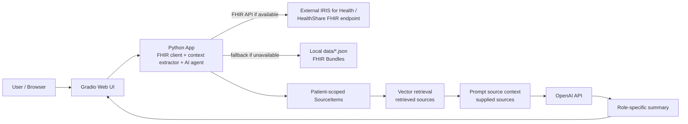

# Smart Patient Summary Generator

Smart Patient Summary Generator is an InterSystems IRIS for Health FHIR demo
application. It reads FHIR R4 patient data, builds a compact clinical context,
and uses an AI agent to generate role-specific summaries.

Supported roles:

- ED Doctor
- Care Manager
- Patient
- Family Caregiver

## Contest Task

This project implements the suggested task **Smart Patient Summary Generator**
for the **InterSystems Programming Contest: AI Agents for FHIR**.

Contest announcement:

https://community.intersystems.com/post/intersystems-programming-contest-ai-agents-fhir

The application generates:

- Current Issues
- Recent Changes
- Risks and Follow-up

The workflow uses these FHIR resource types:

- Patient
- Condition
- MedicationRequest
- AllergyIntolerance
- Observation
- Encounter
- CarePlan

## Team

| Name | Role | Developer Community Profile |
|---|---|---|
| Jan Rheineck | Developer | https://community.intersystems.com/user/jan-rheineck |
| Niyu Tong | Developer | https://community.intersystems.com/user/niyu-tong |

## Features

- Reads FHIR R4 patient bundles from InterSystems IRIS for Health when the FHIR
  endpoint is available.
- Falls back to local synthetic/public FHIR sample bundles when IRIS is not
  available.
- Lets the user select a patient and a summary role. Patient dropdown labels
  include name, DOB, and age; duplicate labels add a short Patient ID while the
  app still uses the full `Patient.id` internally.
- Streams a single OpenAI summary request into the UI as markdown is produced.
- Generates the three required summary sections in one model response.
- Runs patient-scoped source retrieval before prompt construction. The default
  backend is a local lexical vector search over the selected patient's
  `SourceItem` objects, with explicit fallback to all patient-scoped sources if
  retrieval is disabled or unavailable.
- Shows Reference Data Sources as the supplied `[Sx]` FHIR source items that
  were actually sent to the model. Each item can expand to specific evidence
  fields and, separately, the single raw FHIR resource behind that evidence.
- Displays a citation warning in non-strict mode if validation still finds
  invalid, missing, or unsupported-looking citations after repair.
- Supports multiple local patient JSON bundles in the `data/` directory.
- Runs as a Dockerized web app that connects to a user-provided IRIS for
  Health or HealthShare FHIR endpoint.

## Architecture



Main components:

- `src.start`: startup entry point. It checks whether the configured user
  IRIS FHIR endpoint is available and optionally loads local FHIR bundles into
  IRIS when explicitly enabled.
- `src.fhir_loader`: posts local FHIR transaction bundles into IRIS.
- `src.fhir_client`: reads FHIR resources from IRIS or from local fallback JSON.
- `src.context_extractor`: converts FHIR resources into compact clinical text.
- `src.tools.source_items`: builds citeable FHIR source items and source-index
  context from the seven supported resource types.
- `src.tools.vector_search`: retrieves patient-scoped source items while
  preserving the complete `SourceItem` objects used for citation evidence.
- `src.tools.prompt_loader`: assembles the shared system policy and selected
  role YAML prompt.
- `src.agent`: retrieves patient-scoped sources, builds supplied source context,
  selects the role prompt, calls the OpenAI streaming API, and optionally
  repairs invalid, missing, or unsupported-looking citations.
- `src.app`: Gradio web UI.

For Open Exchange usage, the Docker Compose default starts only the web app.
Users connect it to their own IRIS for Health or HealthShare FHIR endpoint with
`IRIS_BASE_URL`.

## How It Works

1. The user starts the application.
2. The application checks the configured IRIS FHIR R4 endpoint.
3. If IRIS is available, the application uses the FHIR API.
4. If IRIS is unavailable, the application reads local FHIR bundle JSON files.
5. The user selects a patient from the dropdown.
6. The user selects `ED Doctor`, `Care Manager`, `Patient`, or
   `Family Caregiver`.
7. The application builds citeable `SourceItem` objects for patient
   demographics, conditions, medications, allergies, observations, encounters,
   and care plans.
8. Patient-scoped vector retrieval selects retrieved source items. The context
   builder then applies the prompt budget and produces the supplied source
   items actually sent to the model.
9. The AI agent makes one streaming OpenAI request and generates three sections:
   - Current Issues
   - Recent Changes
   - Risks and Follow-up
10. The UI updates accumulated markdown as chunks arrive and displays
   expandable supplied reference source data. Summary citations like `[S3]`
   refer to supplied items in the Reference Data Sources panel. The panel also
   summarizes retrieved, supplied, and cited source-id counts.

## Using the App

The app is intended to help demo users and clinicians quickly turn FHIR patient
records into a concise, role-specific summary. It does not replace clinical
judgment.

To use the app:

1. Start it with either Python or Docker.
2. Open `http://localhost:7860`.
3. Select a patient from the dropdown.
4. Select a role: `ED Doctor`, `Care Manager`, `Patient`, or
   `Family Caregiver`.
5. Click `Generate Summary`.
6. Review the generated `Current Issues`, `Recent Changes`, and
   `Risks and Follow-up` sections.
7. Expand `Reference Data Sources` to inspect supplied source indices, evidence
   fields, and optional raw FHIR resources available to the summary.

## Demo

Video demo:

https://youtu.be/rOKGINwaqDU

Demo steps:

1. Start the application.
2. Open `http://localhost:7860`.
3. Select a patient from the dropdown.
4. Select a summary role.
5. Click `Generate Summary`.
6. Review `Current Issues`, `Recent Changes`, and `Risks and Follow-up`.
7. Expand `Reference Data Sources` to inspect the supplied FHIR evidence used
   by the agent.

## Prerequisites

- Python 3.11 or newer
- Docker and Docker Compose, if running the container workflow
- A user-provided InterSystems IRIS for Health or HealthShare FHIR endpoint
- OpenAI API key

## Installation

Clone the repository and enter the project directory:

```powershell
git clone https://github.com/niyuT96/fhir-patient-summary.git
cd fhir-patient-summary
```

Create a local environment file:

```powershell
Copy-Item .env.example .env
notepad .env
```

Set `OPENAI_API_KEY` and adjust the IRIS connection settings if you want to
connect to a live IRIS for Health or HealthShare FHIR endpoint. If the endpoint
is unavailable, the app can still run with the local fallback data in `data/`.

For local Python usage, install dependencies:

```powershell
pip install -r requirements.txt
```

For Docker usage, no local Python package installation is required. Docker
installs the Python dependencies inside the image when you run:

```powershell
docker compose up --build
```

## Configuration

Make sure `.env` contains at least:

```env
OPENAI_API_KEY=your-openai-api-key-here
IRIS_USERNAME=superuser
IRIS_PASSWORD=SYS
IRIS_BASE_URL=http://localhost:52773/csp/healthshare/fhir/fhir/r4
FHIR_FALLBACK_PATH=data
LOAD_SAMPLE_BUNDLE=false
OPENAI_MODEL=gpt-4o-mini
OPENAI_TEMPERATURE=0.3
OPENAI_MAX_TOKENS=800
STREAM_THROTTLE_SECONDS=0.2
VECTOR_SEARCH_ENABLED=true
VECTOR_SEARCH_BACKEND=local
VECTOR_SEARCH_MAX_ITEMS=40
VECTOR_SEARCH_EMBEDDING_MODEL=text-embedding-3-small
CITATION_REPAIR_ENABLED=true
CITATION_REPAIR_MAX_ATTEMPTS=1
CITATION_STRICT_MODE=false
```

Important environment variables:

| Variable | Purpose |
|---|---|
| `OPENAI_API_KEY` | Required. Used by the OpenAI client. |
| `OPENAI_MODEL` | OpenAI model used for summary generation. Default is `gpt-4o-mini`. |
| `OPENAI_TEMPERATURE` | Model temperature. Default is `0.3`. |
| `OPENAI_MAX_TOKENS` | Maximum tokens for each model response. Default is `800`. |
| `STREAM_THROTTLE_SECONDS` | Streaming UI throttle interval in seconds. Default is `0.2`. |
| `VECTOR_SEARCH_ENABLED` | Whether to run patient-scoped retrieval before prompt construction. Default is `true`. |
| `VECTOR_SEARCH_BACKEND` | Retrieval backend. `local` uses in-memory lexical vectors. `openai` uses OpenAI embeddings and falls back to local retrieval if embedding fails. Default is `local`. |
| `VECTOR_SEARCH_MAX_ITEMS` | Maximum retrieved source items before prompt-budget truncation. Default is `40`. |
| `VECTOR_SEARCH_EMBEDDING_MODEL` | Embedding model used only when `VECTOR_SEARCH_BACKEND=openai`. Default is `text-embedding-3-small`. |
| `CITATION_REPAIR_ENABLED` | Whether the app should ask the LLM to repair invalid or missing source citations after the streamed draft. Default is `true`. |
| `CITATION_REPAIR_MAX_ATTEMPTS` | Maximum citation repair attempts. Default is `1`. |
| `CITATION_STRICT_MODE` | If `true`, return an error when citation validation still fails after repair. If `false`, show the summary with a citation warning. Default is `false`. |
| `FHIR_MAX_PAGES` | Maximum FHIR Bundle pages to follow for a resource query. Default is `10`. |
| `IRIS_BASE_URL` | IRIS FHIR R4 endpoint. |
| `IRIS_USERNAME` | IRIS basic-auth username. |
| `IRIS_PASSWORD` | IRIS basic-auth password. |
| `FHIR_FALLBACK_PATH` | File or directory used when IRIS is unavailable. |
| `LOAD_SAMPLE_BUNDLE` | Whether startup should POST local bundles into IRIS. Default is `false`. |

Do not commit `.env`. It may contain secrets.

Choose `IRIS_BASE_URL` based on how the app is started:

- Python running on the host machine:
  `http://localhost:52773/csp/healthshare/fhir/fhir/r4`
- Docker app container connecting to an IRIS server on the host machine:
  `http://host.docker.internal:52773/csp/healthshare/fhir/fhir/r4`

If the configured IRIS endpoint is unavailable, the app starts in local fallback
mode and reads FHIR bundles from `FHIR_FALLBACK_PATH`.

The application sends `Accept: application/fhir+json` for FHIR GET requests.
This is required by some IRIS for Health and HealthShare FHIR endpoints.

## Running Locally

This option runs the Python app directly on your computer.

Create and edit `.env` as described above. If your IRIS server is also running
on your computer, use `localhost` in `IRIS_BASE_URL`:

```env
IRIS_BASE_URL=http://localhost:52773/csp/healthshare/fhir/fhir/r4
```

Install dependencies:

```powershell
pip install -r requirements.txt
```

Start the app:

```powershell
python -m src
```

Open:

```text
http://localhost:7860
```

## Running With Docker

The Docker image packages the web application only. It does not require users
to run a bundled IRIS container. Set `IRIS_BASE_URL` to the user's own IRIS for
Health or HealthShare FHIR R4 endpoint.

Create and edit `.env` as described above. For an IRIS server running on the
host machine, use `host.docker.internal` because `localhost` inside the app
container refers to the container itself:

```env
IRIS_BASE_URL=http://host.docker.internal:52773/csp/healthshare/fhir/fhir/r4
```

If no IRIS server is reachable, the Dockerized app still starts and uses the
local FHIR bundles copied into the image from `data/`.

Check the configured IRIS FHIR endpoint from PowerShell:

```powershell
$env:IRIS_BASE_URL="http://localhost:52773/csp/healthshare/fhir/fhir/r4"
$env:IRIS_USERNAME="superuser"
$env:IRIS_PASSWORD="SYS"
.\scripts\check-iris.ps1
```

Start the Dockerized web app:

```powershell
docker compose up --build
```

Or use the helper script:

```powershell
.\scripts\run-docker.ps1
```

Detached mode:

```powershell
.\scripts\run-docker.ps1 -Detached
```

The UI is available at:

```text
http://localhost:7860
```

Optional local IRIS development profile:

```powershell
docker compose --profile local-iris up --build
```

The `local-iris` profile is for development only. Open Exchange users are
expected to connect the web app to their own IRIS FHIR endpoint. Starting this
profile creates an IRIS container, but the app can also be tested without it by
using local fallback data.

## Sample Data

The app supports both local fallback data and IRIS FHIR Server data.

Local fallback can point to either:

- One FHIR Bundle JSON file
- One directory containing multiple `*.json` FHIR Bundle files

Current recommended setting:

```env
FHIR_FALLBACK_PATH=data
```

With this setting, the app reads every JSON file directly under `data/`.

Each JSON file should be a FHIR Bundle. The code reads resources from:

```text
entry[].resource
```

The FHIR Bundle files in `data/` are sourced from the InterSystems
`samples-FHIR-resource-repository`:
https://github.com/intersystems/samples-FHIR-resource-repository

When IRIS is unavailable, the app uses local fallback data and lists all
`Patient` resources found. When IRIS is available and `LOAD_SAMPLE_BUNDLE=true`,
startup attempts to POST each JSON bundle into the configured IRIS FHIR
endpoint. Keep `LOAD_SAMPLE_BUNDLE=false` when connecting to a user's existing
FHIR server and no sample data should be written.

The local sample data is synthetic/public FHIR sample data. Do not add real
patient data to this repository.

## Patient Selection

The patient dropdown is built from readable labels:

```text
Jane Doe | DOB: 1980-01-01 | Age: 46
```

If two patients have the same base label, the UI appends a short Patient ID:

```text
Jane Doe | DOB: 1980-01-01 | Age: 46 | ID: abc12345
```

The label is only for display. Internally, the app maps the selected unique
label to the full `Patient.id`.

## Model and Prompts

Model settings can be overridden with environment variables:

```env
OPENAI_MODEL=gpt-4o-mini
OPENAI_TEMPERATURE=0.3
OPENAI_MAX_TOKENS=800
STREAM_THROTTLE_SECONDS=0.2
```

Prompts are loaded from files:

- `src/prompts/system_policy.md`
- `src/prompts/roles/ED_Doctor.yaml`
- `src/prompts/roles/Care_Manager.yaml`
- `src/prompts/roles/Patient.yaml`
- `src/prompts/roles/Family_Caregiver.yaml`

The application builds patient-scoped source items for all roles. The selected
role changes both the assembled system prompt and the broad retrieval query, so
the supplied evidence and output are framed for an ED doctor, care manager,
patient, or family caregiver.

The prompt includes a source-index citation policy. Factual claims should cite
valid supplied Reference Data Sources ids such as `[S3]`; after streaming,
citation validation can invoke one repair request to add missing citations,
replace invalid ids, replace unsupported-looking citations, or remove
unsupported claims. In non-strict mode, residual citation problems are shown as
a UI warning. In strict mode, residual citation problems return an error.

Summary generation uses the OpenAI streaming API. The app sends one request
with `stream=True`, then renders accumulated markdown as chunks arrive. The
generate button stays disabled while streaming and is re-enabled when the
generator finishes or returns an error; completion is not inferred from the
number of markdown section headings.

## Testing

Run:

```powershell
pytest -q
```

## Development Tools

This project was developed with assistance from:

- Kiro, used for requirements, design, and task planning.
- OpenAI Codex, used for implementation assistance, code review, testing
  support, and documentation refinement.

All generated code and documentation were reviewed and adapted by the project
team.

## Limitations

- The application is a contest MVP, not a production clinical decision support
  system.
- The generated summary must be reviewed by a qualified clinician.
- If the configured user IRIS endpoint is unavailable, the app uses local
  fallback FHIR bundles.
- The application does not write generated summaries back to FHIR resources.
- The application does not include full medication interaction checking.

## Open Exchange Submission Notes

| Field | Value |
|---|---|
| GitHub or GitLab URL | https://github.com/niyuT96/fhir-patient-summary |
| Open Exchange URL | https://openexchange.intersystems.com/package/fhir-patient-summary |
| Demo video URL | https://youtu.be/rOKGINwaqDU |
| Team member DC profiles | Jan Rheineck: https://community.intersystems.com/user/jan-rheineck; Niyu Tong: https://community.intersystems.com/user/niyu-tong |
| Contest task | Smart Patient Summary Generator |
| InterSystems product | InterSystems IRIS for Health  |

Suggested short description:

```text
An AI agent for InterSystems IRIS for Health that reads FHIR patient data and
generates role-specific patient summaries for emergency doctors, care managers,
patients, and family caregivers.
```


## Data References

- InterSystems FHIR sample data:
  https://github.com/intersystems/samples-FHIR-resource-repository
- Synthea synthetic patient population simulator:
  https://github.com/synthetichealth/synthea
- FHIR R4 specification:
  https://hl7.org/fhir/R4/

## License

This project is licensed under the MIT License. See `LICENSE`.
